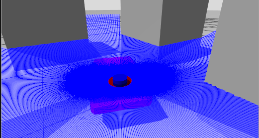
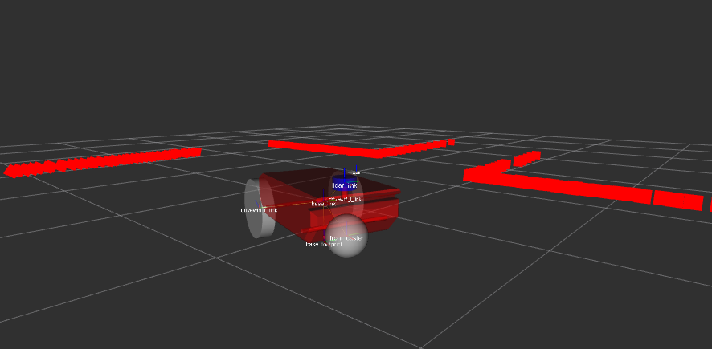

# LIDAR robot setup

This repo containes a ROS2 package that represents a mobile robot with LIDAR. It can be used for LIDAR projects. RViz and Gazebo are synced.




## Demo


## Build

```bash
mkdir -p ~/ros_ws/src
cd ~/ros_ws/src
git clone https://github.com/FrenkenFlores/ros2-mobile-robot.git
cd ~/ros_ws
source /opt/ros/jazzy/setup.bash
colcon build --symlink-install
source install/setup.bash
```

## Launch

RViz + `robot_state_publisher` + joint state publisher:
```bash
ros2 launch robot_description launch.py
```
RViz + `robot_state_publisher` + joint state publisher + Gazebog:
```bash
ros2 launch robot_description launch.py use_gz:=true use_sim_time:=true
```
To control the robot use teleop_twist_keyboard
```bash
sudo apt install ros-jazzy-teleop-twist-keyboard
ros2 run teleop_twist_keyboard teleop_twist_keyboard
```
