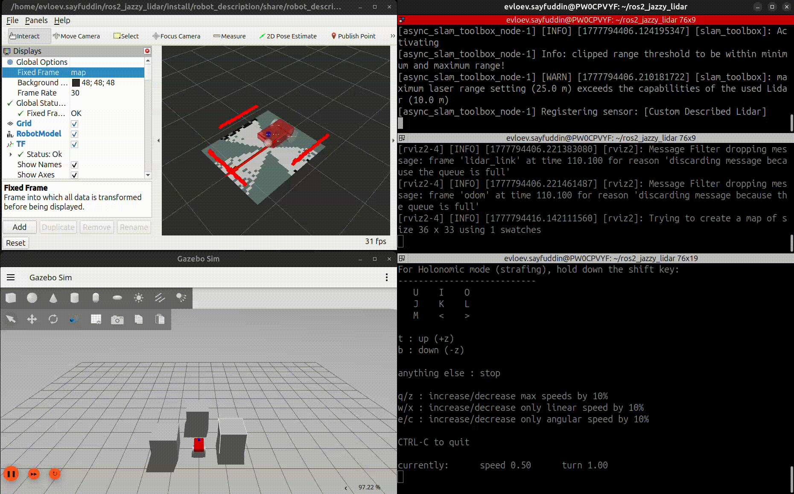
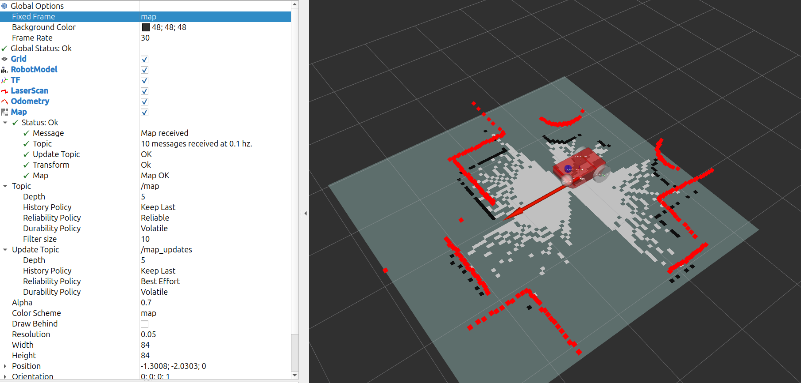
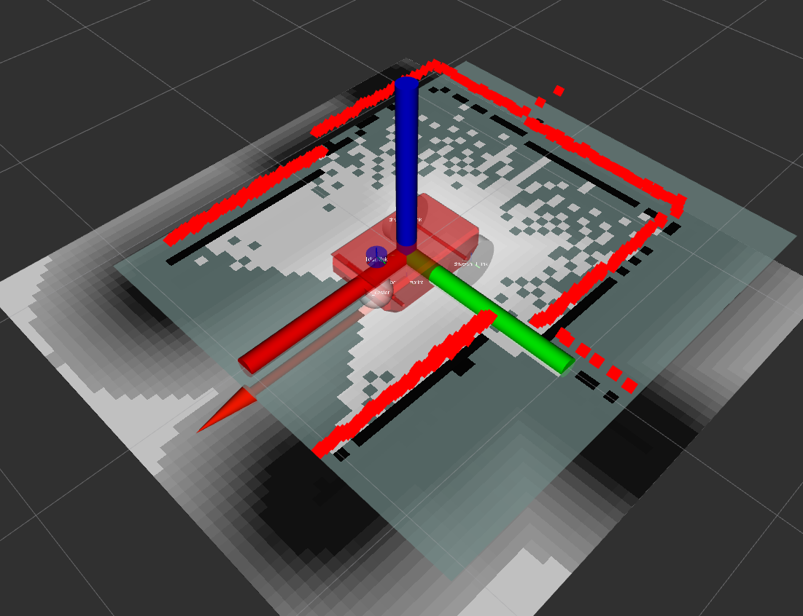

# LIDAR robot setup

This repo containes a ROS2 package that represents a mobile robot with LIDAR. It can be used for LIDAR projects. RViz and Gazebo are synced.


## Demo


## Build

```bash
mkdir -p ~/ros_ws/src
cd ~/ros_ws/src
git clone https://github.com/FrenkenFlores/ros2-mobile-robot.git robot_description
cd ~/ros_ws
source /opt/ros/jazzy/setup.bash
colcon build --symlink-install
source install/setup.bash
```

## Requirements
```bash
# Install joint state publisher to a topic for RViz
sudo apt install ros-jazzy-joint-state-publisher-gui
# Install control tool
sudo apt install ros-jazzy-teleop-twist-keyboard
# Install SLAM toolbox
sudo apt install ros-jazzy-slam-toolbox
# Install NAV2
sudo apt install ros-jazzy-navigation2
sudo apt install ros-jazzy-nav2-bringup
# Install Moveit
sudo apt install ros2-jazzy-moveit
sudo apt install ros2-jazzy-moveit-*

# Install pkg requirements
rosdep install --from-paths src --ignore-src -r -y
```

## Launch

RViz + Robot state publisher + Joint state publisher:
```bash
ros2 launch robot_description launch.py
```
RViz + Robot state publisher + Joint state publisher + Gazebo:
```bash
ros2 launch robot_description launch.py use_gz:=true use_sim_time:=true
```
To control the robot use teleop_twist_keyboard
```bash
# In separate terminal
ros2 run teleop_twist_keyboard teleop_twist_keyboard
```

## LIDAR/SLAM
Launch the slam_toolbox and from RViz set the new fixed frame as `map`



```bash
# In separate terminal. Launch the SLAM.
ros2 launch slam_toolbox online_async_launch.py use_sim_time:=true slam_params_file:=robot_description/config/slam_params.yaml
# In separate termial. Build the map
ros2 run teleop_twist_keyboard teleop_twist_keyboard
```

# NAV2
You can use NAV2 to plan you trajectory. Launch SLAM toolbox and NAV2 in two separate terminals after running the launch.py



```bash
ros2 launch nav2_bringup navigation_launch.py params_file:=robot_description/config/nav2_params.yaml use_sim_time:=true
```